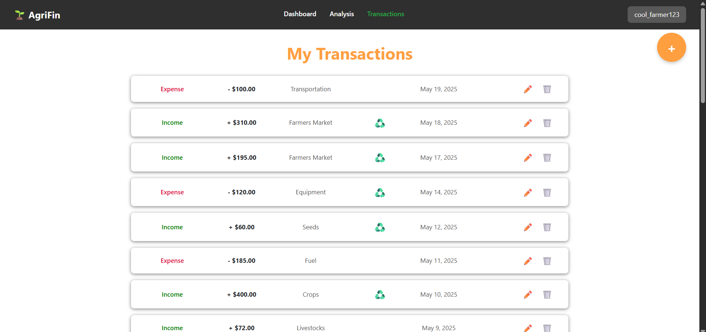

Note: This project is an extended version of [FinTrack](https://github.com/thucchi-cs/FinTrack) (also originally made by thucchi-cs in 2025). Check out [FinTrack](https://github.com/thucchi-cs/FinTrack) to see the entire original coding progress.

# AgriFin

## Description

A financial management tool tailored to help small farmers and local agricultural businesses manage costs and track sustainable practices. In this website, users can add in financial transactions related to their farming business. Each transaction allows users to input details about it and its impact on the environment. After inputting their transactions, users can analyze their activities and sustainability practices through easy to understand graphs and charts.

## Getting Started

This website is deployed on the web with Render at [AgriFin](https://argifin-chb5.onrender.com). We used the free hobby version of Render, so the website will take a few minutes to load initially. 

1. Log in to your account

or register with an username and password

2. View your account overview on the dashboard

and see all your transactions on the transactions tab

3. Add, edit or delete your transactions. Input its details about the environmental impact.

4. View analysis on your activities and environmental impacts on the analysis tab

## Creating AgriFin
This website was entirely programmed by thucchi-cs in May 2025. 
* Online PostgreSQL database on Supabase
* Coded with Python using Flask framework
* JavaScript, HTML, CSS used for styling and design
* Charts were created with JavaScript's Chartjs
* Deployed on Render